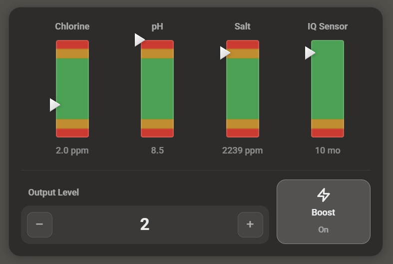
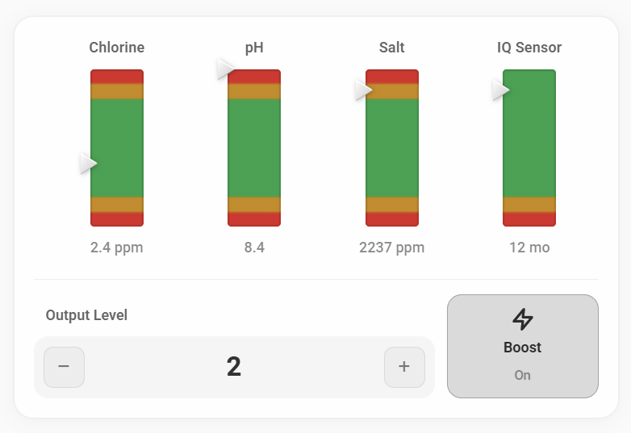
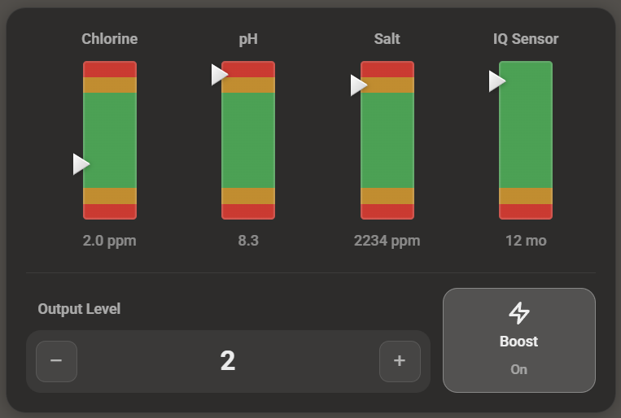
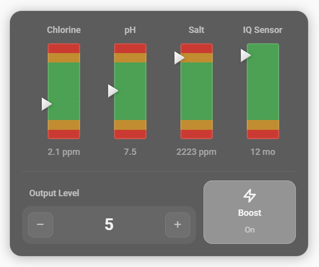

# Spa Monitor Card

Home Assistant Lovelace card for HotSpring/ESP-IQ2020 water quality monitoring with vertical bar gauges, triangle indicators, and integrated salt system controls.

Fork of [pool-monitor-card](https://github.com/wilsto/pool-monitor-card) by [wilsto](https://github.com/wilsto), redesigned for salt water care systems.



---

## Features

- **Vertical bar gauges** with color-coded gradients (red/yellow/green zones)
- **3D triangle indicators** positioned by current sensor value
- **Salt system controls**: output level stepper and boost toggle
- **4 theme modes**: auto, light, dark, and glass (visionOS-style)
- **Visual config editor** with entity pickers (no YAML required)
- **Glassmorphism design** with backdrop blur and translucent surfaces
- **Fully customizable** via CSS custom properties and card-mod

---

## Installation

### HACS (recommended)

1. Open [HACS](https://hacs.xyz/) > Frontend > three-dot menu > Custom repositories
2. Add `https://github.com/JoeQuantum/spa-monitor-card` with category **Plugin**
3. Search for **Spa Monitor Card**, install, and reload your browser

### Manual

1. Download `spa-monitor-card.js` from the [latest release](https://github.com/JoeQuantum/spa-monitor-card/releases)
2. Copy to `config/www/spa-monitor-card/spa-monitor-card.js`
3. Add resource in Settings > Dashboards > Resources:
   - URL: `/local/spa-monitor-card/spa-monitor-card.js`
   - Type: JavaScript Module

---

## Configuration

The card includes a **visual config editor** — add the card via the UI and configure it with entity pickers, no YAML needed. You can also configure via YAML directly.

### Full example

```yaml
type: custom:spa-monitor-card
title: Water Quality
theme: auto
sensors:
  chlorine:
    entity: sensor.hot_tub_iq_chlorine
  ph:
    entity: sensor.hot_tub_iq_ph
  salt:
    entity: sensor.hot_tub_iq_salt
  iq_sensor:
    entity: sensor.hot_tub_iq_hours_left
controls:
  output_level:
    entity: number.hot_spring_aria_salt_power
  boost:
    entity: switch.hot_spring_aria_salt_boost
```

### Card options

| Option | Type | Default | Description |
|--------|------|---------|-------------|
| `title` | string | *(none)* | Card title. Omit to hide the header row. |
| `theme` | string | `auto` | `auto`, `light`, `dark`, or `glass`. See [Themes](#themes). |
| `sensors` | object | **required** | At least one sensor must be defined. |
| `controls` | object | *(none)* | Optional salt system controls. Omit to hide the controls row. |

### Predefined sensors

The four sensors below have built-in defaults. Just provide an `entity` and the rest is filled in automatically.

| Sensor ID | Name | Unit | Min | Max | Green Range | Gradient | Display Format |
|-----------|------|------|-----|-----|-------------|----------|----------------|
| `chlorine` | Chlorine | ppm | 0 | 10 | 1.0 – 5.0 ppm | standard | numeric |
| `ph` | pH | *(none)* | 6.0 | 9.0 | 7.2 – 7.8 | standard | numeric |
| `salt` | Salt | ppm | 1000 | 3000 | 1500 – 2000 ppm | standard | numeric |
| `iq_sensor` | IQ Sensor | hours | 0 | 10000 | 1460+ hours (~2+ mo) | depletion | hours_to_months |

Green ranges are from official HotSpring FreshWater documentation. Yellow and red zone boundaries are inferred from ESP-IQ2020 protocol analysis and dealer reports.

### Per-sensor options

Any preset default can be overridden:

```yaml
sensors:
  chlorine:
    entity: sensor.hot_tub_iq_chlorine
    name: "Free Cl"
    unit: "ppm"
    min: 0
    max: 10
    decimals: 1
    gradient: standard
    display_format: null
```

| Option | Type | Description |
|--------|------|-------------|
| `entity` | string | **Required.** Entity ID for the sensor. |
| `name` | string | Override the display label above the bar. |
| `unit` | string | Override the unit shown after the value. |
| `min` | number | Minimum value for the gauge range. |
| `max` | number | Maximum value for the gauge range. |
| `decimals` | number | Number of decimal places (default varies by sensor). |
| `gradient` | string | `standard` (red-yellow-green-yellow-red) or `depletion` (green-yellow-red). |
| `display_format` | string | `hours_to_months` converts raw hours to months via `Math.round(value / 720)`. See below. |

#### display_format: hours_to_months

The `hours_to_months` format divides the raw sensor value by 720 (hours per 30-day month) and rounds to the nearest integer. This is the default for the `iq_sensor` preset.

The FreshWater IQ sensor starts at ~10,000 hours when a new cartridge is installed and counts down. With this format, 10000 hours displays as "14 mo" and 720 hours displays as "1 mo".

### Controls

| Control | Type | Entity pattern | Description |
|---------|------|----------------|-------------|
| `output_level` | number | `number.*_salt_power` | Salt system output level (0-10). Rendered as a stepper with +/- buttons. Min/max read from entity attributes. |
| `boost` | switch | `switch.*_salt_boost` | Salt boost toggle. Rendered as a tap button with lightning icon. |

Both controls are optional. Omit the `controls` section entirely to hide the controls row and divider.

---

## Sensor Ranges

Each sensor has a color-coded gradient bar with green (ideal), yellow (caution), and red (danger) zones. The green zones are based on **HotSpring official documentation** for FreshWater IQ salt systems. Yellow and red boundaries are inferred from ESP-IQ2020 protocol analysis and dealer service reports.

### Chlorine

| Zone | Range | Bar Position |
|------|-------|-------------|
| Red (low) | 0 – 0.5 ppm | 0% – 5% |
| Yellow (low) | 0.5 – 1.0 ppm | 5% – 10% |
| **Green (ideal)** | **1.0 – 5.0 ppm** | **10% – 50%** |
| Yellow (high) | 5.0 – 8.0 ppm | 50% – 80% |
| Red (high) | 8.0 – 10.0 ppm | 80% – 100% |

Range: 0 – 10 ppm. The FreshWater salt system targets 1 – 5 ppm free chlorine as measured by the IQ sensor.

### pH

| Zone | Range | Bar Position |
|------|-------|-------------|
| Red (low) | 6.0 – 6.8 | 0% – 27% |
| Yellow (low) | 6.8 – 7.2 | 27% – 40% |
| **Green (ideal)** | **7.2 – 7.8** | **40% – 60%** |
| Yellow (high) | 7.8 – 8.2 | 60% – 73% |
| Red (high) | 8.2 – 9.0 | 73% – 100% |

Range: 6.0 – 9.0 pH. HotSpring recommends 7.2 – 7.8 for bather comfort and sanitizer efficacy.

### Salt

| Zone | Range | Bar Position |
|------|-------|-------------|
| Red (low) | 1000 – 1250 ppm | 0% – 12% |
| Yellow (low) | 1250 – 1500 ppm | 12% – 25% |
| **Green (ideal)** | **1500 – 2000 ppm** | **25% – 50%** |
| Yellow (high) | 2000 – 2500 ppm | 50% – 75% |
| Red (high) | 2500 – 3000 ppm | 75% – 100% |

Range: 1000 – 3000 ppm, target 1750 ppm. **Note:** The IQ module reports a ppm-equivalent value derived from conductivity/TDS measurement, not a direct chemical assay. Actual sodium chloride concentration may differ from the reported value.

### IQ Sensor (cartridge life)

| Zone | Range | Bar Position |
|------|-------|-------------|
| Red (depleted) | 0 hours | 0% – 1% |
| Yellow (low life) | 1 – 1460 hours | 1% – 15% |
| **Green (good life)** | **1460 – 10000 hours** | **15% – 100%** |

Range: 0 – 10,000 hours. Displayed as months via `Math.round(value / 720)` (720 hours per 30-day month). A new FreshWater IQ cartridge starts at ~10,000 hours (~14 months). The yellow zone begins at ~2 months remaining.

---

## Themes

The `theme` option controls the card's appearance. All themes use glassmorphism (translucent backgrounds with backdrop blur).

| Value | Description |
|-------|-------------|
| `auto` | Detects dark/light from Home Assistant's active theme (`hass.themes.darkMode`). |
| `light` | Forces light mode — translucent white card with dark text. |
| `dark` | Forces dark mode — translucent dark card with light text. |
| `glass` | visionOS-style glassmorphism — highly translucent with light text, designed for wallpaper-style dashboard backgrounds. |

### Theme previews

<!-- TODO: Add screenshots for each theme -->
| Light | Dark | Glass |
|-------|------|-------|
|  |  |  |

The `glass` theme is designed for visionOS-style dashboards where cards float over rich background images. It uses a more translucent background (`rgba(255, 255, 255, 0.08)`) with stronger backdrop blur for a frosted glass effect.

---

## CSS Custom Properties

All colors and dimensions are exposed as CSS custom properties for [card-mod](https://github.com/thomasloven/lovelace-card-mod) overrides. All properties use the `--spa-` prefix.

### Card container

| Variable | Default (light) | Description |
|----------|-----------------|-------------|
| `--spa-card-bg` | `rgba(255, 255, 255, 0.72)` | Card background color |
| `--spa-card-border` | `rgba(0, 0, 0, 0.12)` | Card border color |
| `--spa-card-shadow` | `0 2px 16px rgba(0,0,0,0.08), ...` | Card box shadow |
| `--spa-card-radius` | `16px` | Card border radius |
| `--spa-card-blur` | `40px` | Card backdrop blur amount |
| `--spa-card-padding` | `16px` | Card inner padding |

### Typography

| Variable | Default (light) | Description |
|----------|-----------------|-------------|
| `--spa-header-color` | `rgba(0, 0, 0, 0.75)` | Header title text color |
| `--spa-label-color` | `rgba(0, 0, 0, 0.6)` | Sensor label and Output Level label color |
| `--spa-value-color` | `rgba(0, 0, 0, 0.45)` | Sensor value text color |

### Bar gauges

| Variable | Default (light) | Description |
|----------|-----------------|-------------|
| `--spa-bar-width` | `44px` | Bar gauge width |
| `--spa-bar-height` | `130px` | Bar gauge height |
| `--spa-bar-radius` | `3px` | Bar gauge border radius |
| `--spa-bar-border` | `rgba(0, 0, 0, 0.1)` | Bar gauge inset border color |

### Gradient colors

| Variable | Default | Description |
|----------|---------|-------------|
| `--spa-color-danger` | `#dc2626` | Gradient danger zone color (red) |
| `--spa-color-caution` | `#ca8a04` | Gradient caution zone color (yellow) |
| `--spa-color-ideal` | `#16a34a` | Gradient ideal zone color (green) |

### Controls

| Variable | Default (light) | Description |
|----------|-----------------|-------------|
| `--spa-control-bg` | `rgba(0, 0, 0, 0.035)` | Control background color |
| `--spa-control-border` | `rgba(0, 0, 0, 0.08)` | Control border color |
| `--spa-control-active-bg` | `rgba(0, 0, 0, 0.14)` | Active control background (boost on) |
| `--spa-control-active-border` | `rgba(0, 0, 0, 0.25)` | Active control border (boost on) |
| `--spa-text-primary` | `rgba(0, 0, 0, 0.8)` | Primary text color (output level value) |
| `--spa-text-secondary` | `rgba(0, 0, 0, 0.5)` | Secondary text color (buttons, labels) |
| `--spa-text-tertiary` | `rgba(0, 0, 0, 0.3)` | Tertiary text color (boost state) |

### Divider

| Variable | Default (light) | Description |
|----------|-----------------|-------------|
| `--spa-divider-color` | `rgba(0, 0, 0, 0.06)` | Divider line color |

### Example card-mod override

```yaml
type: custom:spa-monitor-card
card_mod:
  style: |
    :host {
      --spa-color-ideal: #22c55e;
      --spa-bar-height: 160px;
    }
```

---

## Visual Config Editor

The card includes a built-in visual editor accessible from the HA dashboard UI. The editor provides:

- **Title** text input
- **Theme** dropdown (Auto / Light / Dark / Glass)
- **Sensor entity pickers** for all 4 predefined sensors (Chlorine, pH, Salt, IQ Sensor)
- **Control entity pickers** for Output Level (number domain) and Boost (switch domain)

All entity pickers support domain filtering and custom entity input.

---

## Credits

- Fork of [pool-monitor-card](https://github.com/wilsto/pool-monitor-card) by [wilsto](https://github.com/wilsto)
- Built for the [ESP-IQ2020](https://github.com/Ylianst/ESP-IQ2020) integration by [Ylianst](https://github.com/Ylianst)

## License

MIT
